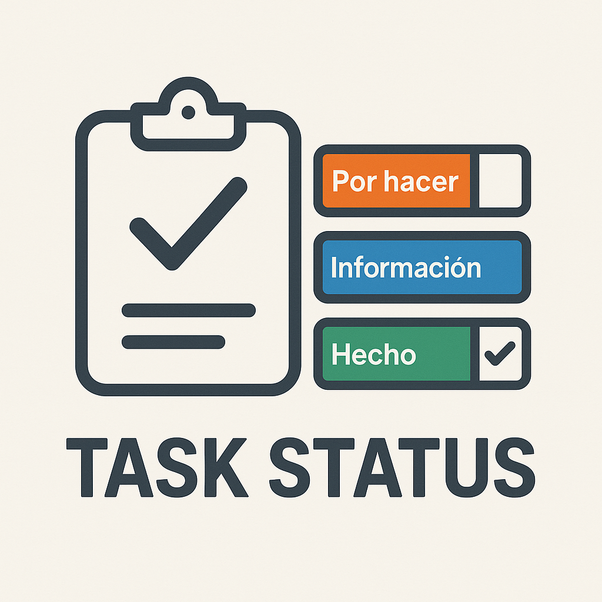
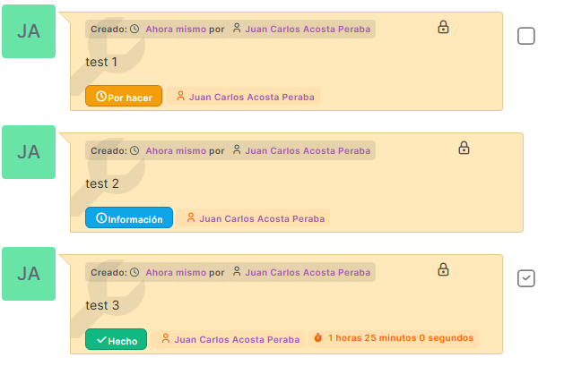
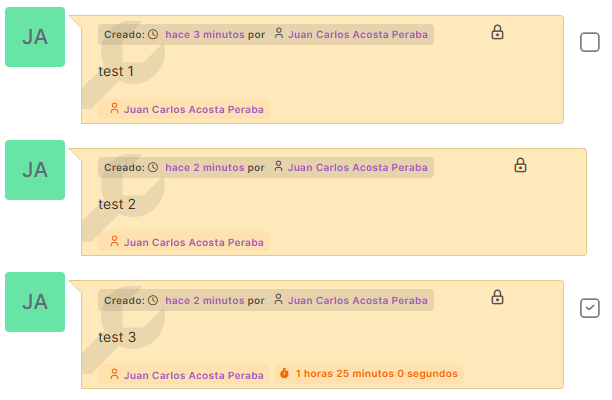
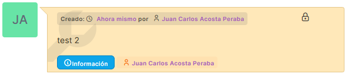
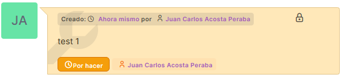
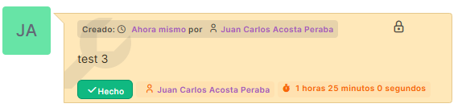

<div align="center">
  
  <h1>Task Status Display</h1>
  
  [](https://github.com/JuanCarlosAcostaPeraba/glpi-taskstatus-plugin/releases)
  [](https://plugins.glpi-project.org/#/plugin/taskstatus)
  [](https://glpi-project.org)
  [](https://www.gnu.org/licenses/gpl-3.0.html)
  []()
  
  <p>A lightweight and non-intrusive GLPI plugin that enhances the ticket timeline by displaying visual status badges directly on task entries — without modifying any GLPI core files.</p>
  
  <p><strong>También disponible en español</strong> - <a href="#español">Leer en español</a> 📖</p>
</div>

---

## ✨ Features

- 🔹 Displays **visual status badges** on task timeline entries
- 🔹 Three color-coded states for quick identification:
  - 🔵 **Information** (blue)
  - 🟠 **To Do** (orange)
  - 🟢 **Done** (green)
- 🔹 **Automatic badge updates** when task status changes
- 🔹 Works for TicketTask, ProjectTask, and ITILTask
- 🔹 Fully hook-based — **no core overrides**
- 🔹 **Zero configuration** required — works out of the box
- 🔹 **Multilingual support**: English, Spanish, and French

## 📦 Requirements

- GLPI **10.0.x**
- PHP **7.4+**

## 🚀 Installation

### Option 1: Manual Installation

1. Download the latest release from [GitHub Releases](https://github.com/JuanCarlosAcostaPeraba/glpi-taskstatus-plugin/releases)
2. Extract and copy the folder `taskstatus` into:

    ```
    glpi/plugins/
    ```

3. Go to **GLPI → Configuration → Plugins**
4. Find **Task Status Display**
5. Click **Install**, then **Enable**

### Option 2: From Source

```bash
cd /path/to/glpi/plugins/
git clone https://github.com/JuanCarlosAcostaPeraba/glpi-taskstatus-plugin.git taskstatus
```

Then follow steps 3-5 from above.

## ⚙️ Usage

Once installed and enabled, status badges will automatically appear in the timeline of all tickets. **No configuration required.**

The plugin automatically:
- ✅ Detects task entries in the timeline
- ✅ Reads their current status
- ✅ Displays a color-coded badge with icon and label
- ✅ Updates badges when status changes via MutationObserver

## 📸 Screenshots

<table>
  <tr>
    <td align="center">
      <br>
      <em>All task status badges displayed in timeline</em>
    </td>
    <td align="center">
      <br>
      <em>Timeline view without the plugin</em>
    </td>
  </tr>
  <tr>
    <td align="center">
      <br>
      <em>Information state (blue badge)</em>
    </td>
    <td align="center">
      <br>
      <em>To Do state (orange badge)</em>
    </td>
  </tr>
  <tr>
    <td align="center" colspan="2">
      <br>
      <em>Done state (green badge)</em>
    </td>
  </tr>
</table>

## 🧩 How it works

### Task Detection

The plugin uses a MutationObserver to monitor the GLPI timeline for task entries (TicketTask, ProjectTask, ITILTask). When a task is detected, it:

1. Extracts the task status from DOM classes or data attributes
2. Creates a color-coded badge with icon and label
3. Inserts the badge into the timeline-badges container

### Status States

The plugin recognizes three task states based on GLPI's Planning class:

- **State 0 (Information)**: Blue badge with info icon
- **State 1 (To Do)**: Orange badge with clock icon
- **State 2 (Done)**: Green badge with check icon

### Dynamic Updates

When a task status changes, the MutationObserver detects the DOM modification and automatically:

- Removes the old badge
- Creates a new badge with the updated status
- Re-inserts it in the timeline

## 🏗️ Plugin Structure

```
taskstatus/
├── setup.php              # Plugin registration + hooks
├── plugin.xml             # Plugin metadata for GLPI marketplace
├── js/
│   └── taskstatus.js      # Frontend badge injection and updates
├── css/
│   └── taskstatus.css     # Styling for status badges
├── locales/
│   ├── en_GB.php          # English translations
│   ├── es_ES.php          # Spanish translations
│   └── fr_FR.php          # French translations
├── assets/
│   ├── logo.png           # Plugin logo
│   └── screenshots/       # Screenshots for marketplace
└── README.md
```

## 🔌 Hooks Used

- **`add_css`**: Injects custom CSS for badge styling
- **`add_javascript`**: Injects JavaScript for badge management and MutationObserver
- **`csrf_compliant`**: Marks plugin as CSRF-compliant

## 🌐 Translations

- English (en_GB) - Default
- Spanish (es_ES)
- French (fr_FR)

## 🤝 Contributing

Contributions are welcome! If you'd like to contribute:

1. Fork the repository
2. Create a feature branch (`git checkout -b feature/amazing-feature`)
3. Commit your changes (`git commit -m 'Add some amazing feature'`)
4. Push to the branch (`git push origin feature/amazing-feature`)
5. Open a Pull Request

Please ensure your code follows existing style conventions and test your changes thoroughly.

## 🐛 Support

If you encounter any issues or have questions:

- **Bug Reports**: [Open an issue](https://github.com/JuanCarlosAcostaPeraba/glpi-taskstatus-plugin/issues)
- **Feature Requests**: [Open an issue](https://github.com/JuanCarlosAcostaPeraba/glpi-taskstatus-plugin/issues)
- **Questions**: [Discussions](https://github.com/JuanCarlosAcostaPeraba/glpi-taskstatus-plugin/discussions)

## 📝 License

**GPLv3+**

Fully compatible with GLPI plugin licensing requirements. See the [LICENSE](LICENSE) file for details.

## 👤 Author

Developed by **[Juan Carlos Acosta Perabá](https://github.com/JuanCarlosAcostaPeraba)** for **HUC – Hospital Universitario de Canarias**.

## 🙏 Acknowledgments

- GLPI Development Team for the excellent GLPI platform
- All contributors who help improve this plugin

---

# Español

<div align="center">
  
  <h2>Task Status Display</h2>
  
  <p>Un plugin ligero y no intrusivo para GLPI que mejora la línea de tiempo de los tickets mostrando badges de estado visuales directamente en las entradas de tareas — sin modificar ningún archivo del núcleo de GLPI.</p>
</div>

## ✨ Características

- 🔹 Muestra **badges de estado visuales** en las entradas de tareas de la línea de tiempo
- 🔹 Tres estados con código de color para identificación rápida:
  - 🔵 **Información** (azul)
  - 🟠 **Por hacer** (naranja)
  - 🟢 **Hecho** (verde)
- 🔹 **Actualización automática de badges** cuando cambia el estado de las tareas
- 🔹 Funciona con TicketTask, ProjectTask e ITILTask
- 🔹 Totalmente basado en hooks — **sin modificaciones del núcleo**
- 🔹 **Sin configuración** requerida — funciona directamente
- 🔹 **Soporte multiidioma**: inglés, español y francés

## 📦 Requisitos

- GLPI **10.0.x**
- PHP **7.4+**

## 🚀 Instalación

### Opción 1: Instalación Manual

1. Descarga la última versión desde [GitHub Releases](https://github.com/JuanCarlosAcostaPeraba/glpi-taskstatus-plugin/releases)
2. Extrae y copia la carpeta `taskstatus` en:

    ```
    glpi/plugins/
    ```

3. Ve a **GLPI → Configuración → Plugins**
4. Busca **Task Status Display**
5. Haz clic en **Instalar** y luego en **Activar**

### Opción 2: Desde el Código Fuente

```bash
cd /ruta/a/glpi/plugins/
git clone https://github.com/JuanCarlosAcostaPeraba/glpi-taskstatus-plugin.git taskstatus
```

Luego sigue los pasos 3-5 de arriba.

## 📸 Capturas de Pantalla

<table>
  <tr>
    <td align="center">
      <br>
      <em>Todos los badges de estado en la línea de tiempo</em>
    </td>
    <td align="center">
      <br>
      <em>Vista de línea de tiempo sin el plugin</em>
    </td>
  </tr>
  <tr>
    <td align="center">
      <br>
      <em>Estado Información (badge azul)</em>
    </td>
    <td align="center">
      <br>
      <em>Estado Por hacer (badge naranja)</em>
    </td>
  </tr>
  <tr>
    <td align="center" colspan="2">
      <br>
      <em>Estado Hecho (badge verde)</em>
    </td>
  </tr>
</table>

## ⚙️ Uso

Una vez instalado y activado, los badges de estado aparecerán automáticamente en la línea de tiempo de todos los tickets. **Sin configuración requerida.**

El plugin automáticamente:
- ✅ Detecta entradas de tareas en la línea de tiempo
- ✅ Lee su estado actual
- ✅ Muestra un badge con código de color con icono y etiqueta
- ✅ Actualiza los badges cuando cambia el estado mediante MutationObserver

## 🧩 Cómo Funciona

### Detección de Tareas

El plugin utiliza un MutationObserver para monitorear la línea de tiempo de GLPI en busca de entradas de tareas (TicketTask, ProjectTask, ITILTask). Cuando se detecta una tarea:

1. Extrae el estado de la tarea desde las clases DOM o atributos de datos
2. Crea un badge con código de color con icono y etiqueta
3. Inserta el badge en el contenedor timeline-badges

### Estados de Tareas

El plugin reconoce tres estados de tareas basados en la clase Planning de GLPI:

- **Estado 0 (Información)**: Badge azul con icono de información
- **Estado 1 (Por hacer)**: Badge naranja con icono de reloj
- **Estado 2 (Hecho)**: Badge verde con icono de check

### Actualizaciones Dinámicas

Cuando cambia el estado de una tarea, el MutationObserver detecta la modificación del DOM y automáticamente:

- Elimina el badge antiguo
- Crea un nuevo badge con el estado actualizado
- Lo reinserta en la línea de tiempo

## 🏗️ Estructura del Plugin

```
taskstatus/
├── setup.php              # Registro del plugin + hooks
├── plugin.xml             # Metadatos del plugin para GLPI marketplace
├── js/
│   └── taskstatus.js      # Inyección y actualización de badges en frontend
├── css/
│   └── taskstatus.css     # Estilos para los badges de estado
├── locales/
│   ├── en_GB.php          # Traducciones en inglés
│   ├── es_ES.php          # Traducciones en español
│   └── fr_FR.php          # Traducciones en francés
├── assets/
│   ├── logo.png           # Logo del plugin
│   └── screenshots/       # Capturas para el marketplace
└── README.md
```

## 🔌 Hooks Utilizados

- **`add_css`**: Inyecta CSS personalizado para estilos de badges
- **`add_javascript`**: Inyecta JavaScript para gestión de badges y MutationObserver
- **`csrf_compliant`**: Marca el plugin como compatible con CSRF

## 🌐 Traducciones

- Inglés (en_GB) - Por defecto
- Español (es_ES)
- Francés (fr_FR)

## 🤝 Contribuir

¡Las contribuciones son bienvenidas! Si deseas contribuir:

1. Haz fork del repositorio
2. Crea una rama para tu característica (`git checkout -b feature/caracteristica-increible`)
3. Confirma tus cambios (`git commit -m 'Añade característica increíble'`)
4. Sube a la rama (`git push origin feature/caracteristica-increible`)
5. Abre un Pull Request

Por favor asegúrate de que tu código sigue las convenciones de estilo existentes y prueba tus cambios a fondo.

## 🐛 Soporte

Si encuentras algún problema o tienes preguntas:

- **Reportar Bugs**: [Abrir un issue](https://github.com/JuanCarlosAcostaPeraba/glpi-taskstatus-plugin/issues)
- **Solicitar Características**: [Abrir un issue](https://github.com/JuanCarlosAcostaPeraba/glpi-taskstatus-plugin/issues)
- **Preguntas**: [Discusiones](https://github.com/JuanCarlosAcostaPeraba/glpi-taskstatus-plugin/discussions)

## 📝 Licencia

**GPLv3+**

Totalmente compatible con los requisitos de licencia de plugins de GLPI. Consulta el archivo [LICENSE](LICENSE) para más detalles.

## 👤 Autor

Desarrollado por **[Juan Carlos Acosta Perabá](https://github.com/JuanCarlosAcostaPeraba)** para **HUC – Hospital Universitario de Canarias**.

## 🙏 Agradecimientos

- Equipo de Desarrollo de GLPI por la excelente plataforma GLPI
- Todos los colaboradores que ayudan a mejorar este plugin
